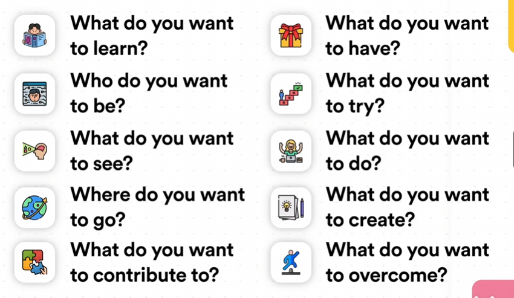
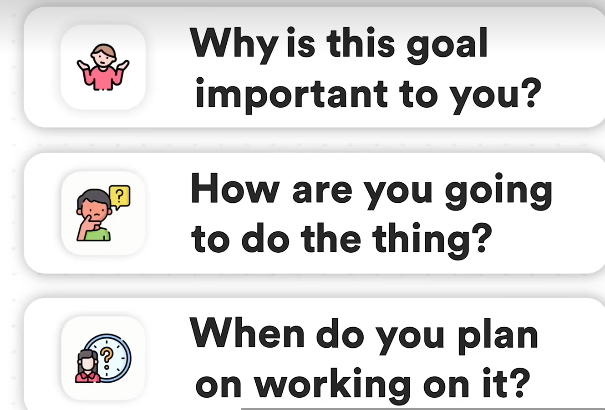

 ### Ali Abdaal
 #### 关于迷茫
- ##### 为何迷茫：
  1.Starting piont
  2.Destination
  3.Path
- 迷茫是一种常态，人生需要动态的目标
 Life is a journey rather than a destination.
 你可以随时转变人生方向
- 你想为社会提供什么：TED演讲法、你又什么优势可以提供给社会、想象葬礼上的场景
一定要写下来！！！
- Overcome Fear
 无畏之梦、 悲剧之梦、推迟之梦
- 理想的一天/一周
- 你完美之后会有什么改变？
谁是你的榜样？讣告法
- ##### 我在哪
- 关于工作：什么是你喜欢的，什么是你不喜欢的
- 关于生活：什么是你喜欢的，什么是你不喜欢的（关于健康和人际关系）
- 生命之轮：

对此进行评分：以此作为思考的途径，以此做出行动规划。
记得循序渐进，一步一步来。
不是追求幸福，而是在追求过程中感受幸福。
- 列出关于“我的真相”：旁观者清。
- ##### 我想要什么
- 注意：避免欲望模仿
即：很多时候是身边的人的欲望去影响我们本身的欲望，我们应当找到自己的欲望。
- 满足感故事：想一件你主动参与、让你感到满足感和成就感的事情。
- 能力审计：对你日常的事项进行能力统计，因此合理安排自己的日常，然后知道自己喜欢什么。
- 关于我12个月后的真相：
我会....我会....这样去了解自己，不去追求世俗意义上的成功。
成功就是向着你认为有意义的事情上努力，然后享受旅途。
#### 十年之梦

- 越多越好
- 避免完美主义
- 不要担心物质主义

#### 奥德赛计划
- Current Path
: 若是按照你如今的路线持续下去5年，你的生活会是什么样？假想一天。
- Alternative Path
: 若是按照你另一道的路线持续下去5年，你的生活会是什么样？假想一天。
- Radical Path
: 如果你的经济状态不限和责任不限，你会怎么怎么做，5年后会怎么样？

#### 12月庆典法
：12月后你最想庆祝的事情是什么？
- Prompts: Health, Relationship, Work.
- Focus on 3-5 goals.
- Further Prompts:

#### 日记提示语
- 如果不用为钱烦恼，你会做什么
  ：如果我有足够的时间和钱，我该怎么利用我的才能为别人服务
- 你想成为什么样的角色（人，朋友，孩子，父母，男女朋友）
- 如果要我重复上周的工作，我未来会怎样，这是我想要的未来吗 
- 过去两周事件，什么让我充电？什么让我耗电？
- 生命之轮
- 奥德赛计划
  ❶如果我接下来继续走我现在的路，我5年后会怎样
  ❷如果我选择了一条完全不同的路，我5年后会怎么样（代替方案）
  ❸如果我选择了一条完全不同的路，我不在乎钱，也不在乎别人怎么想（激进方案）
- 你的目标是什么，瓶颈是什么，
- 博恩·崔西，写下你想要在未来一年完成的10件事（用完成时写），思考哪一件成功了对你积极意义最大
  ❶把这件事当做目标
  ❷目标完成时间
  ❸列出目标所需的一切行动
  ❹整理成待办清单
  ❺执行
  ❻每天去做一点点
- 创业者思维，你给公司打工还是公司给你打工
- 如果我知道我将在2年后死去，我将如何度过这两年
